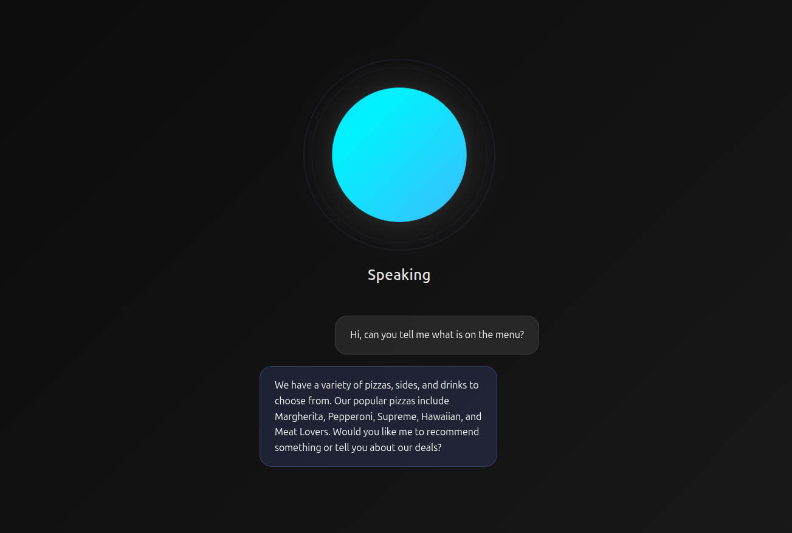

# Voice Response System with Multi-Layer Intent Recognition Pipeline

A **hybrid intent recognition system** combining classical NLP pattern matching, neural semantic embeddings, and large language models for robust conversational AI. The system has a novel three-layer architecture that balances speed, accuracy, and interpretability.

**Use Case**: Domain-agnostic customer service

**Current Domain**: Pizza Restaurant

**Research Focus**: Hybrid NLP approach combining rule-based, embedding-based, and generative techniques

### Key Features

- **Multi-Layer Intent Recognition Pipeline**
  - Layer 1 - Pattern Matching: Algorithmic recognition using Levenshtein edit distance, TF-IDF weighted indexing, and synonym expansion
  - Layer 2 - Neural Embeddings: Semantic similarity using Sentence Transformer embeddings (SBERT) for context-aware matching
  - Layer 3 - Generative AI: LLM-based classification with conversation history awareness (OpenAI API or local Ollama)
  - Boost Engine: Domain-specific contextual rules applying negative sentiment detection, entity keyword matching, and co-occurrence patterns

- **End-to-End Voice Interaction**
  - **ASR (Automatic Speech Recognition)**: OpenAI Whisper with audio preprocessing for robust transcription
  - **TTS (Text-to-Speech)**: Coqui TTS neural vocoder (VITS architecture)
  - **Full conversational loop**: Speech → Text → Intent → Response → Speech

## Quick Start

Get the system running in 3 steps:

### 1. Install Dependencies

```bash
# Install system dependencies
sudo apt install software-properties-common
sudo add-apt-repository ppa:deadsnakes/ppa
sudo apt update
sudo apt install python3.11 python3.11-venv ffmpeg espeak-ng

# Clone and setup
git clone https://github.com/atpritam/Voice-Assistant.git
cd Voice-Assistant
python3.11 -m venv .venv
source .venv/bin/activate
pip install -r requirements.txt
```

### 2. Choose Your LLM Backend

**Option A: Local LLM with Ollama (Recommended - Free & Private)**

```bash
# Install Ollama
curl -fsSL https://ollama.com/install.sh | sh

# Pull model and start service
ollama pull llama3.2:3b-instruct-q4_K_M
ollama serve &
```

**Option B: OpenAI API (Faster setup, requires API key)**

Edit `app.py` and set `USE_LOCAL_LLM = False`

```bash
# Get API key from https://platform.openai.com/api-keys
```

### 3. Run the Application

```bash
# Create .env file with generated SECRET_KEY
echo "SECRET_KEY=$(python3 -c 'import secrets; print(secrets.token_hex(32))')" > .env

# If using OpenAI (Option B above), also add:
echo "OPENAI_API_KEY=your-openai-api-key-here" >> .env

# Start the application
python app.py
```

Access the web interface at `http://localhost:5000`

### Web Interface



The web interface provides a simple and intuitive way to interact with the voice assistant, showing real-time transcription and system responses.

## System Architecture

### Intent Recognition Pipeline

The system implements a cascading three-layer architecture where each layer applies progressively sophisticated techniques until confident intent recognition is achieved:

1. **Algorithmic Layer**: Fast pattern matching using NLP preprocessing, TF-IDF candidate ranking, synonym expansion, and fuzzy string similarity
2. **Semantic Layer**: Neural semantic matching using transformer-based sentence embeddings (SBERT) for distributional semantic similarity
3. **LLM Layer**: Fallback to large language models for ambiguous queries and natural response generation

Each layer can be independently enabled or disabled with configurable confidence thresholds.

```
User Voice Input
     ↓
[ASR - Whisper]
     ↓
Text Query
     ↓
┌─────────────────────────┐
│ Intent Recognition      │
│                         │
│ 1. Algorithmic (fast)   │ ← 80% of queries
│    ├─ Pattern matching  │
│    ├─ Levenshtein      │
│    └─ Boost Engine      │
│         ↓               │
│ 2. Semantic (accurate)  │ ← 14% of queries
│    └─ Neural embeddings │
│         ↓               │
│ 3. LLM (fallback)       │ ← 6% of queries
│    └─ Ollama/OpenAI    │
└─────────────────────────┘
     ↓
Response Generation
     ↓
[TTS - Coqui VITS]
     ↓
Voice Output
```

### Full Pipeline vs. LLM-Only

Modern large language models (e.g., GPT-5, Claude, Llama) can perform intent classification and response generation directly. However, the hybrid cascading architecture provides significant advantages in both speed and efficiency.

**Comparative Performance (400 queries, GPT-5 & Llama 3.2-3B):**

| Configuration                | Accuracy   | Latency | Q/s | Tokens/Query | Total Tokens |
|------------------------------|------------|---------|-----|--------------|--------------|
| **Full Pipeline (Llama 3B)** | **97.75%** | **22.1ms** | **45.3** | **0.9** | **377**      |
| **Full Pipeline (GPT-5)**    | **97.75%** | **379.5ms** | **2.6** | **32.4** | **12,941**   |
| LLM-Only (Llama 3B, local)   | 88.50%     | 272.1ms | 3.7 | 15.9 | 6,363        |
| LLM-Only (GPT-5, cloud)      | 92.50%     | **6.65s** | 0.2 | **511.3** | **204,503**  |

**Key Advantages:**

1. **17× Lower Latency**: 379ms vs 6.65s (GPT-5)
     - ~81% of queries handled by fast algorithmic layer (<5ms)
     - LLM reserved only for complex edge cases (6% of queries)
2. **Cost Efficiency**: 32 tokens/query vs 511 tokens/query (15.8× reduction with GPT-5)
3. **Accuracy**: 97.75% vs 92.50% (+5.25% improvement over LLM-only with GPT-5)

See `testResults/comparativeTest/` for detailed comparative analysis.

## System Requirements

**Minimum:**
- CPU: Modern multi-core processor
- RAM: 8GB
- Storage: 6GB free space
- Python: **3.11 (Required)** - Coqui TTS limitation

**Recommended:**
- CPU: 4+ cores
- RAM: 16GB
- GPU: NVIDIA GPU with 4GB+ VRAM (CUDA-compatible)
- Storage: 10GB free space

**Note**: All components work on CPU-only systems. GPU acceleration is optional but significantly improves performance.

## Configuration

### Environment Configuration

Create a `.env` file in the project root:

```env
# Required
SECRET_KEY=your_generated_secret_key_here

# Optional - only if using OpenAI instead of local Ollama
OPENAI_API_KEY=your_openai_api_key_here
```

Generate a secure `SECRET_KEY`:
```bash
python3 -c 'import secrets; print(secrets.token_hex(32))'
```

### Pipeline Configuration

Edit `app.py` to configure the intent recognition pipeline:

```python
# Layer enabling
ENABLE_ALGORITHMIC = True
ENABLE_SEMANTIC = True
ENABLE_LLM = True

# Confidence thresholds
ALGORITHMIC_THRESHOLD = 0.6
SEMANTIC_THRESHOLD = 0.5

# Model selection
SEMANTIC_MODEL = "all-MiniLM-L6-v2" # Options: all-mpnet-base-v2
USE_LOCAL_LLM = True  # True for Ollama, False for OpenAI
LLM_MODEL = "llama3.2:3b-instruct-q4_K_M"  # or "gpt-5-nano" for OpenAI
```

### TTS Configuration

```python
ENABLE_TTS = True
TTS_MODEL = "tts_models/en/ljspeech/vits"
```

### ASR Configuration

```python
ENABLE_ASR = True
ASR_MODEL = "tiny.en"  # Options: tiny.en, base.en, small.en, medium.en, large
ENABLE_AUDIO_PREPROCESSING = True
```

## Usage

### Running the Application inside vENV

```bash
python app.py
```

Access the web interface at `http://localhost:5000`

### Using Ollama (Local LLM)

1. Install Ollama from https://ollama.ai
    ```
   curl -fsSL https://ollama.com/install.sh | sh
   ```
2. Pull the desired model:
   ```bash
   ollama pull llama3.2:3b-instruct-q4_K_M
   ```
3. Ensure Ollama is running on `http://localhost:11434`
    ```bash
   ollama serve &
    ```
   ```bash
   # test local llm 
   ollama run llama3.2:3b-instruct-q4_K_M "Say hello in 5 words"
    ```
4. Set `USE_LOCAL_LLM = True` in `app.py`

## Running Tests

The project includes comprehensive test suites for the intent recognition pipeline. Tests are located in the `test/` directory.

### Basic Comprehensive Test

Run a full evaluation of the current pipeline configuration:

```bash
python -m test.runtest
```

### Comparative Analysis

Compare multiple pipeline configurations side-by-side:

```bash
python -m test.runtest -c
```

### Boost Engine Analysis

Evaluate the impact of the contextual boost engine:

```bash
python -m test.runtest -b
```

### Confusion Matrix and Error Analysis

Generate confusion matrix with per-intent metrics:

```bash
python -m test.runtest -mx
```

### Custom Test Configurations

```bash
# Test without semantic layer
python -m test.runtest --no-semantic

# Test algorithmic layer only
python -m test.runtest --no-semantic --no-llm

# Comparative test without boost engine
python -m test.runtest -c --no-boost

# Test without edge cases (standard dataset only)
python -m test.runtest --no-edge

# Use OpenAI instead of Ollama
python -m test.runtest --openai

# Single query test
python -m test.runtest "where is my pizza?" --exp delivery
```

## Performance Benchmarks

All tests use semantic model `all-mpnet-base-v2` and LLM model `llama3.2:3b-instruct-q4_K_M`.

### Extended Test Dataset (400 queries - with edge cases)

Comprehensive testing with 400 queries including 105 edge cases:

| Configuration | Accuracy | Avg Time | Queries/s |
|--------------|----------|----------|-----------|
| Full Pipeline | 97.75% | 22.1ms | 45.3 |
| Algorithmic + Semantic | 94.75% | 7.2ms | 138.5 |
| Algorithmic + LLM | 96.00% | 54.0ms | 18.5 |
| Semantic + LLM | 93.75% | 44.6ms | 22.4 |
| Algorithmic Only | 90.00% | 2.7ms | 365.0 |
| Semantic Only | 89.25% | 9.8ms | 102.4 |
| LLM Only | 88.50% | 272.1ms | 3.7 |

### Layer Distribution (Full Pipeline)

- Algorithmic layer: 80.8% of queries (323/400)
- Semantic layer: 13.3% of queries (53/400)
- LLM layer: 6.0% of queries (24/400)

### Boost Engine Impact

Comparison with and without contextual boost rules on full pipeline (400 queries with edge cases):

| Metric              | Without Boost | With Boost | Improvement |
|---------------------|---------------|------------|-------------|
| Accuracy            | 95.00% | 97.75% | +2.75% |
| Correct Predictions | 380 | 391 | +11 |
| Query Time          | 34.4ms | 22.8ms | 34% faster |
| Algorithmic Usage   | 268 | 323 | +55 |
| Semantic Usage      | 95 | 53 | -42 |
| LLM Fallback        | 37 | 24 | -13 |

### Confusion Matrix Results (Full Pipeline - 400 queries)

#### Per-Intent Performance

| Intent | Precision | Recall | F1-Score | Support |
|--------|-----------|--------|----------|---------|
| complaint | 100.00% | 95.24% | 97.56% | 84 |
| delivery | 96.43% | 96.43% | 96.43% | 56 |
| general | 100.00% | 100.00% | 100.00% | 22 |
| hours_location | 96.83% | 98.39% | 97.60% | 62 |
| menu_inquiry | 98.85% | 97.73% | 98.29% | 88 |
| order | 95.65% | 100.00% | 97.78% | 88 |


See `testResults/` directory for detailed  analyses.

### Test Dataset Quality

The benchmark results above are validated against dataset with:

- **400 total queries** (295 normal + 105 edge cases)
- **6 intent categories**: order (88), complaint (84), menu_inquiry (88), hours_location (62), delivery (56), general (22)
- **Diversity score: 0.97/1.0** - High lexical variety, not repetitive memorization
- **Edge cases include**: Multi-intent queries, sarcasm, typos, slang, very short queries, ambiguous phrasing
- **Zero duplicates** - Unbiased evaluation

## Key Technical Features

### Algorithmic Layer

- **Information Retrieval**: Inverted index with TF-IDF weighting for efficient candidate selection
- **String Similarity Metrics**: Levenshtein edit distance with length-based prefiltering
- **Synonym Expansion**: Domain-specific synonym dictionaries for lexical variation handling
- **NLP Preprocessing**: Contraction expansion, filler word removal, and tokenization
- **N-gram Matching**: Multi-word phrase detection with contextual bonuses
- **Contextual Boost Engine**:
  - Negative sentiment keyword detection for complaint classification
  - Dictionary-based entity keyword matching for domain entities
  - Keyword co-occurrence patterns and contextual heuristics
  - Domain-specific rule-based disambiguation

### Semantic Layer

- **Transformer Embeddings**: Sentence-BERT models (MPNet, MiniLM) for semantic similarity
- **Embedding Caching**: Persistent storage for instant initialization and reduced cold-start latency
- **Batch Processing**: Optimized pattern encoding

### LLM Layer

- **Conversation Context**: Conversation history tracking for context-aware classification and response generation
- Support for both cloud (OpenAI) and local (Ollama) models

## Development

### Extending to Other Domains

1. Update `utils/res_info.json` with your domain information
2. Update intent patterns in `utils/intent_patterns.json`
3. Modify linguistics in `utils/linguistic_resources.json`
4. Adjust boost rules in `intentRecognizer/boostEngine.py` if using algorithmic layer
5. Update llm prompt templates in `intentRecognizer/llm_recognizer.py`
6. Update test dataset in `test/data.py`

## License

This project is part of a Bachelor's Thesis. All rights reserved.

## Acknowledgments

- OpenAI Whisper for speech recognition
- Coqui TTS for speech synthesis
- Sentence Transformers for semantic embeddings
- Ollama for local LLM inference